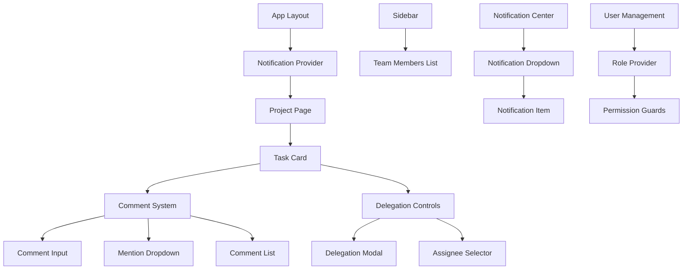
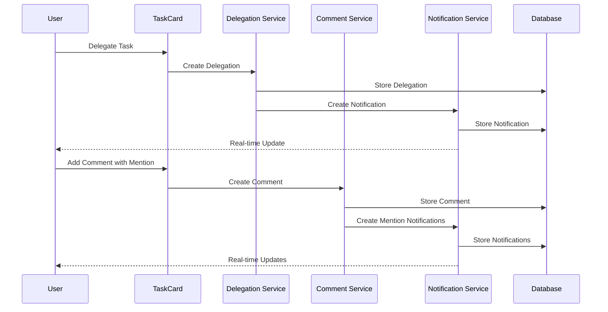

# Design Document

## Overview

The Project Collaboration feature extends the existing MauFlow task management application with comprehensive team collaboration capabilities. This design integrates seamlessly with the current React/Next.js architecture, leveraging existing components like TaskCard, ProjectPage, and the glass UI design system while introducing new collaboration-specific components and data models.

The feature introduces three core collaboration pillars: role-based task delegation, rich commenting with mentions, and real-time in-app notifications. The design maintains the existing glass morphism aesthetic and responsive design patterns while adding new interaction paradigms for team communication.

## Architecture

### Component Architecture



### Data Flow Architecture



### State Management

The design leverages React Query for server state management and React Context for client-side collaboration state:

- **NotificationContext**: Manages real-time notification state and WebSocket connections
- **UserRoleContext**: Handles user permissions and role-based access control
- **CollaborationContext**: Manages active collaboration sessions and team member presence

## Components and Interfaces

### Core Collaboration Components

#### 1. NotificationCenter Component
```typescript
interface NotificationCenterProps {
  className?: string;
}

interface Notification {
  id: string;
  type: 'delegation' | 'mention' | 'task_update' | 'comment';
  title: string;
  message: string;
  taskId?: string;
  projectId?: string;
  fromUserId: string;
  toUserId: string;
  isRead: boolean;
  createdAt: string;
  metadata?: Record<string, any>;
}
```

#### 2. DelegationControls Component
```typescript
interface DelegationControlsProps {
  task: Task;
  onDelegate: (taskId: string, assigneeId: string, note?: string) => void;
  canDelegate: boolean;
}

interface DelegationData {
  taskId: string;
  delegatorId: string;
  assigneeId: string;
  delegatedAt: string;
  note?: string;
  status: 'active' | 'completed' | 'revoked';
}
```

#### 3. CommentWithMentions Component
```typescript
interface CommentWithMentionsProps {
  taskId: string;
  onSubmit: (content: string, mentions: string[]) => void;
  placeholder?: string;
}

interface MentionUser {
  id: string;
  name: string;
  avatar?: string;
  role: string;
}
```

#### 4. TeamMemberSelector Component
```typescript
interface TeamMemberSelectorProps {
  onSelect: (userId: string) => void;
  excludeUsers?: string[];
  filterByRole?: string[];
  searchable?: boolean;
}

interface TeamMember {
  id: string;
  name: string;
  email: string;
  avatar?: string;
  role: UserRole;
  isOnline: boolean;
  lastSeen?: string;
}
```

### Enhanced Existing Components

#### TaskCard Enhancements
The existing TaskCard component will be enhanced with:
- Delegation status indicator
- Assignee avatar display
- Quick delegation button for users with permissions
- Enhanced comment section with mention support

#### ProjectPage Enhancements
The ProjectPage component will include:
- Team member sidebar panel
- Delegation filter options
- Bulk delegation capabilities
- Team activity feed

#### Sidebar Enhancements
The Sidebar component will feature:
- Team members section
- Delegation dashboard
- Notification summary

## Data Models

### User and Role Models
```typescript
interface User {
  id: string;
  name: string;
  email: string;
  avatar?: string;
  role: UserRole;
  permissions: Permission[];
  createdAt: string;
  lastLoginAt?: string;
  isActive: boolean;
}

interface UserRole {
  id: string;
  name: string;
  description: string;
  permissions: Permission[];
  canDelegate: boolean;
  canReceiveDelegations: boolean;
  canManageTeam: boolean;
}

interface Permission {
  id: string;
  name: string;
  resource: string;
  action: string;
}
```

### Collaboration Models
```typescript
interface TaskDelegation {
  id: string;
  taskId: string;
  delegatorId: string;
  assigneeId: string;
  delegatedAt: string;
  completedAt?: string;
  revokedAt?: string;
  note?: string;
  status: 'active' | 'completed' | 'revoked';
  priority: 'normal' | 'urgent';
}

interface TaskComment {
  id: string;
  taskId: string;
  authorId: string;
  content: string;
  mentions: string[];
  createdAt: string;
  updatedAt?: string;
  isEdited: boolean;
  parentCommentId?: string;
  attachments?: string[];
}

interface Notification {
  id: string;
  type: NotificationType;
  title: string;
  message: string;
  recipientId: string;
  senderId?: string;
  resourceId?: string;
  resourceType?: 'task' | 'project' | 'comment';
  isRead: boolean;
  readAt?: string;
  createdAt: string;
  metadata?: Record<string, any>;
}

type NotificationType = 
  | 'task_delegated'
  | 'task_completed'
  | 'task_updated'
  | 'comment_mention'
  | 'comment_reply'
  | 'delegation_revoked';
```

### Enhanced Task Model
```typescript
interface Task {
  // Existing fields...
  id: string;
  title: string;
  description?: string;
  status: 'todo' | 'doing' | 'done';
  priority: 'high' | 'medium' | 'low';
  dueDate?: string;
  createdAt: string;
  updatedAt?: string;
  aiScore?: number;
  projectId?: string;
  
  // New collaboration fields
  assigneeId?: string;
  delegatorId?: string;
  delegatedAt?: string;
  delegationNote?: string;
  collaborators: string[];
  commentCount: number;
  lastCommentAt?: string;
  watchers: string[];
}
```

## Error Handling

### Collaboration-Specific Error Types
```typescript
interface CollaborationError {
  type: 'permission_denied' | 'user_not_found' | 'delegation_failed' | 'notification_failed';
  message: string;
  details?: Record<string, any>;
}
```

### Error Handling Strategies

1. **Permission Errors**: Gracefully hide delegation controls and show informative messages
2. **Network Errors**: Implement retry mechanisms with exponential backoff
3. **Real-time Connection Errors**: Fallback to polling for notifications
4. **Validation Errors**: Provide inline feedback for mention syntax and delegation requirements

### Error Recovery Patterns
- **Optimistic Updates**: Show immediate UI feedback, rollback on failure
- **Offline Support**: Queue delegation and comment actions when offline
- **Conflict Resolution**: Handle concurrent edits to comments and delegations

## Testing Strategy

### Unit Testing
- **Component Testing**: Test all collaboration components in isolation
- **Hook Testing**: Test custom hooks for notifications, delegations, and mentions
- **Utility Testing**: Test mention parsing, permission checking, and notification formatting

### Integration Testing
- **API Integration**: Test collaboration endpoints with mock server
- **Real-time Testing**: Test WebSocket connections and notification delivery
- **Permission Testing**: Test role-based access control across components

### End-to-End Testing
- **Delegation Workflow**: Complete task delegation from assignment to completion
- **Comment Workflow**: Add comments with mentions and verify notifications
- **Notification Workflow**: Test notification creation, delivery, and marking as read

### Performance Testing
- **Notification Load**: Test with high volume of notifications
- **Real-time Scalability**: Test WebSocket performance with multiple users
- **Comment Rendering**: Test performance with large comment threads

### Test Data Setup
```typescript
// Mock data factories for testing
const createMockUser = (overrides?: Partial<User>): User => ({
  id: 'user-1',
  name: 'John Doe',
  email: 'john@example.com',
  role: createMockRole(),
  permissions: [],
  createdAt: '2025-08-29T00:00:00Z',
  isActive: true,
  ...overrides
});

const createMockDelegation = (overrides?: Partial<TaskDelegation>): TaskDelegation => ({
  id: 'delegation-1',
  taskId: 'task-1',
  delegatorId: 'user-1',
  assigneeId: 'user-2',
  delegatedAt: '2025-08-29T00:00:00Z',
  status: 'active',
  priority: 'normal',
  ...overrides
});
```

### Accessibility Testing
- **Keyboard Navigation**: Ensure all collaboration features are keyboard accessible
- **Screen Reader Support**: Test notification announcements and mention feedback
- **Focus Management**: Test focus handling in delegation modals and comment inputs
- **Color Contrast**: Verify collaboration UI elements meet WCAG standards

## Security Considerations

### Authentication and Authorization
- **JWT Token Validation**: Verify user permissions for delegation actions
- **Role-Based Access Control**: Implement granular permissions for collaboration features
- **API Rate Limiting**: Prevent abuse of notification and comment endpoints

### Data Protection
- **Input Sanitization**: Sanitize comment content and mention data
- **XSS Prevention**: Escape user-generated content in comments and notifications
- **CSRF Protection**: Implement CSRF tokens for collaboration actions

### Privacy Controls
- **Mention Privacy**: Allow users to control who can mention them
- **Notification Privacy**: Provide granular notification preferences
- **Data Retention**: Implement policies for comment and notification cleanup

## Performance Optimizations

### Real-time Performance
- **WebSocket Connection Pooling**: Efficient connection management
- **Notification Batching**: Group related notifications to reduce noise
- **Selective Updates**: Only update affected UI components

### Rendering Optimizations
- **Virtual Scrolling**: For large comment threads and notification lists
- **Memoization**: Cache expensive computations for mention parsing
- **Lazy Loading**: Load collaboration data on demand

### Caching Strategy
- **User Data Caching**: Cache team member information
- **Permission Caching**: Cache user permissions with TTL
- **Notification Caching**: Implement efficient notification storage

## Migration Strategy

### Database Migrations
1. **User Roles and Permissions**: Add role-based access control tables
2. **Task Delegations**: Add delegation tracking tables
3. **Enhanced Comments**: Extend comment model with mentions
4. **Notifications**: Create notification system tables

### Feature Rollout
1. **Phase 1**: Basic delegation without notifications
2. **Phase 2**: Comment mentions with email notifications
3. **Phase 3**: Real-time in-app notifications
4. **Phase 4**: Advanced collaboration features

### Backward Compatibility
- Maintain existing task management functionality
- Graceful degradation for users without collaboration permissions
- API versioning for collaboration endpoints